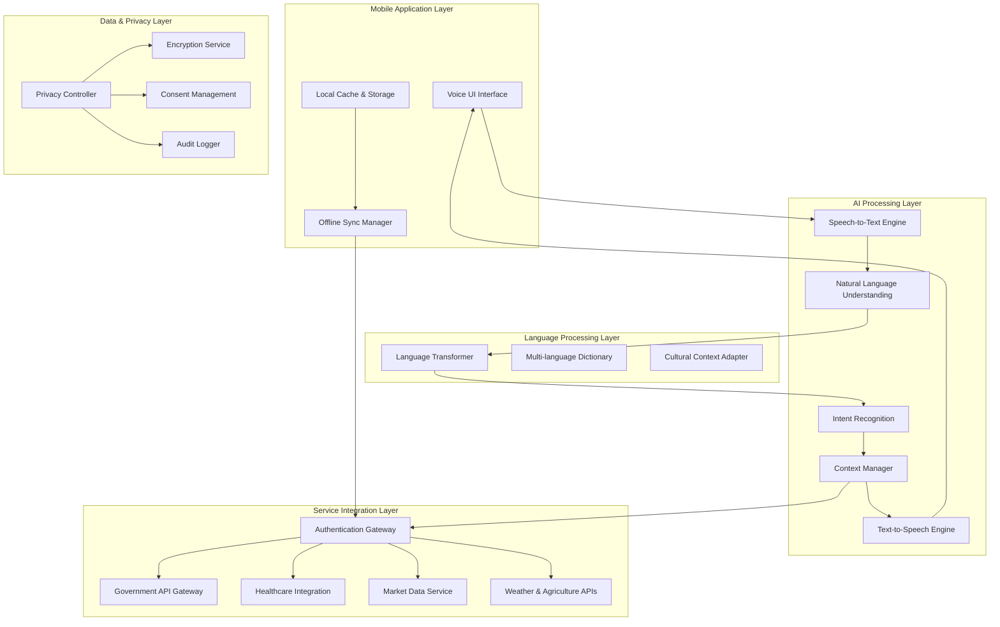

# Design Document: Rural Ecosystem Platform

## Overview

The Rural Ecosystem Platform is a mobile-first AI-powered application designed to bridge the digital divide for rural communities in India. The platform integrates five critical service domains—Agriculture, Knowledge, Economics, Health, and Infrastructure—through a unified voice-based interface optimized for low-bandwidth environments and local language support.

### Key Design Principles

- **Mobile-First Architecture**: Native Android application optimized for rural device constraints
- **Voice-Centric Interaction**: Primary interface through speech recognition and synthesis
- **Bandwidth Optimization**: Designed for 2G/3G networks with intelligent data compression
- **Privacy by Design**: User-controlled data sharing with granular permissions
- **Offline-First Capability**: Core functionality available without internet connectivity
- **Cultural Sensitivity**: Localized content and culturally appropriate interactions

## Architecture

### High-Level System Architecture



### Three-Layer Processing Architecture

Based on the technical requirements, the system implements a three-layer processing model:

1. **Layer 1: End User Interface**
   - Voice input capture and audio output
   - Visual feedback and status indicators
   - Offline capability management
   - Local data caching

2. **Layer 2: AI Processing Layer**
   - Speech-to-text conversion with noise reduction
   - Natural language understanding and intent recognition
   - Context management across conversations
   - Text-to-speech synthesis with regional accent support

3. **Layer 3: Local Language Transformation**
   - Multi-language support (Hindi, English, regional languages)
   - Cultural context adaptation
   - Code-switching handling (mixed language inputs)
   - Semantic preservation across translations

## Components and Interfaces

### Voice Interface Engine

**Core Responsibilities:**
- Ultra-low bandwidth speech processing (targeting <2 kbps using AI compression)
- Noise-robust recognition for rural environments
- Real-time voice activity detection
- Adaptive audio quality based on network conditions

**Technical Implementation:**
- On-device speech recognition for basic commands (offline capability)
- Hybrid cloud-edge processing for complex queries
- Semantic compression for voice data transmission
- Voice biometric authentication for security

**Interface Specifications:**
```typescript
interface VoiceEngine {
  startListening(): Promise<void>
  stopListening(): Promise<AudioData>
  processAudio(audio: AudioData): Promise<TranscriptionResult>
  synthesizeSpeech(text: string, language: Language): Promise<AudioData>
  detectLanguage(audio: AudioData): Promise<Language>
}
```

### AI Processing Core

**Natural Language Understanding:**
- Intent classification for five service domains
- Entity extraction (dates, locations, crop types, symptoms)
- Conversation state management
- Multi-turn dialogue support

**Context Management:**
- User profile and preference storage
- Conversation history maintenance
- Cross-domain context sharing (e.g., weather data for agriculture)
- Personalization based on usage patterns

**Technical Implementation:**
- Lightweight transformer models optimized for mobile deployment
- Federated learning for model improvement while preserving privacy
- Edge computing for latency-sensitive operations

### Language Processing System

**Multi-Language Support:**
- Primary languages: Hindi, English
- Regional languages: Tamil, Telugu, Bengali, Marathi, Gujarati, Punjabi, Kannada, Malayalam, Odia, Assamese
- Code-switching detection and handling
- Cultural context adaptation

**Technical Implementation:**
- Integration with Bhashini AI platform for government-standard language models
- Local language model caching for offline support
- Dialect-aware processing for regional variations
- Cultural sensitivity filters for appropriate responses

### Government Integration Gateway

**DigiLocker Integration:**
- Aadhaar-based authentication
- Document verification and retrieval
- Consent-based data sharing
- KYC compliance for financial services

**API Integrations:**
- UMANG platform for government services
- MyGov portal for scheme information
- e-NAM for agricultural market data
- PMFBY for crop insurance
- Ayushman Bharat for health services

**Technical Implementation:**
```typescript
interface GovernmentGateway {
  authenticateUser(aadhaar: string, otp: string): Promise<AuthResult>
  fetchDocument(docType: DocumentType, consent: ConsentToken): Promise<Document>
  checkSchemeEligibility(userProfile: UserProfile): Promise<SchemeList>
  submitApplication(scheme: Scheme, documents: Document[]): Promise<ApplicationResult>
}
```

### Service Domain Modules

#### Agriculture Module
- **Supply Chain Management**: Direct buyer-farmer connections, collective bargaining
- **Precision Agriculture**: Soil analysis, weather integration, pest detection
- **Market Intelligence**: Price forecasting, trend analysis, alert system
- **Sustainability**: Carbon footprint tracking, sustainable practice recommendations

#### Knowledge Module
- **Peer Learning Network**: AI-clustered groups based on goals and location
- **Skill Development**: Government course integration, personalized learning paths
- **Content Curation**: Filtered educational content, YouTube recommendations
- **Progress Tracking**: Learning outcome measurement, adaptive recommendations

#### Economics Module
- **Financial Services**: Loan eligibility assessment, application assistance
- **Insurance Integration**: Crop insurance, health insurance claim processing
- **Savings Management**: Harvest-based saving recommendations, financial planning
- **Government Schemes**: Eligibility checking, application guidance

#### Health Module
- **Symptom Assessment**: AI-powered pre-screening, risk profiling
- **Telemedicine Integration**: Connection to government and private healthcare providers
- **Health Records**: Integration with ABDM (Ayushman Bharat Digital Mission)
- **Preventive Care**: Health education, vaccination reminders, wellness tips

#### Infrastructure Module
- **Complaint Management**: Government portal integration, issue tracking
- **Scheme Access**: Infrastructure development programs, application assistance
- **Community Engagement**: Local issue discussion, collective action coordination
- **Information Access**: Government policy updates, actionable guidance

## Data Models

### User Profile Model
```typescript
interface UserProfile {
  id: string
  aadhaarHash: string // Encrypted Aadhaar for privacy
  personalInfo: {
    name: string
    age: number
    gender: Gender
    languages: Language[]
    location: GeoLocation
  }
  farmingProfile?: {
    landSize: number
    cropTypes: CropType[]
    farmingMethods: FarmingMethod[]
    seasonalPatterns: SeasonalData[]
  }
  preferences: {
    primaryLanguage: Language
    voiceSettings: VoiceSettings
    privacySettings: PrivacySettings
    notificationPreferences: NotificationSettings
  }
  trustScore: number // Based on peer verification
  consentRecords: ConsentRecord[]
}
```

### Conversation Context Model
```typescript
interface ConversationContext {
  sessionId: string
  userId: string
  domain: ServiceDomain
  intent: Intent
  entities: Entity[]
  conversationHistory: Message[]
  contextVariables: Record<string, any>
  timestamp: Date
  language: Language
}
```

### Service Request Model
```typescript
interface ServiceRequest {
  id: string
  userId: string
  domain: ServiceDomain
  requestType: RequestType
  parameters: Record<string, any>
  status: RequestStatus
  priority: Priority
  createdAt: Date
  updatedAt: Date
  responseData?: any
}
```

### Privacy Consent Model
```typescript
interface ConsentRecord {
  id: string
  userId: string
  dataType: DataType
  purpose: Purpose
  recipient: string
  consentGiven: boolean
  timestamp: Date
  expiryDate?: Date
  revoked: boolean
  revokedAt?: Date
}
```

## Correctness Properties

*A property is a characteristic or behavior that should hold true across all valid executions of a system—essentially, a formal statement about what the system should do. Properties serve as the bridge between human-readable specifications and machine-verifiable correctness guarantees.*

Before defining the correctness properties, I need to analyze the acceptance criteria from the requirements document to determine which ones can be tested as properties.

### Property 1: Voice Interface Round Trip
*For any* text input, converting to speech and then back to text should preserve the semantic meaning and core information
**Validates: Requirements 2.1, 2.2**

### Property 2: Multi-Language Intent Recognition
*For any* supported Indian language input (Hindi, English, regional languages), the system should correctly identify user intent regardless of the language used
**Validates: Requirements 2.3, 14.2**

### Property 3: Conversation Context Preservation
*For any* multi-turn conversation, the AI engine should maintain context across all interactions within a session
**Validates: Requirements 2.6, 13.2**

### Property 4: Ambiguous Input Clarification
*For any* unclear or ambiguous voice input, the platform should request clarification through voice prompts rather than making incorrect assumptions
**Validates: Requirements 2.5**

### Property 5: Bandwidth Optimization
*For any* data transmission, the platform should compress and optimize data to work efficiently on 2G/3G networks
**Validates: Requirements 3.1, 3.3**

### Property 6: Network Resilience
*For any* network connectivity issue, the platform should queue requests during outages and process them when connectivity is restored
**Validates: Requirements 3.5**

### Property 7: Offline-Online Synchronization
*For any* data modified while offline, the platform should synchronize changes when connectivity is restored without data loss
**Validates: Requirements 1.5**

### Property 8: Data Privacy Control
*For any* farmer data sharing request, the platform should require explicit consent and allow granular permission control
**Validates: Requirements 4.1, 4.3, 4.5**

### Property 9: Data Encryption
*For any* sensitive farmer data, the platform should store it using encryption to protect privacy
**Validates: Requirements 4.4**

### Property 10: Buyer-Farmer Connection
*For any* farmer wanting to sell produce, the platform should connect them with verified buyers matching their produce type
**Validates: Requirements 5.1**

### Property 11: Collective Bargaining Grouping
*For any* set of farmers with similar produce, the platform should enable collective bargaining by grouping them together
**Validates: Requirements 5.3**

### Property 12: Market Price Notifications
*For any* significant market price change, the platform should send notifications to farmers with relevant produce
**Validates: Requirements 5.6**

### Property 13: AI Agricultural Analysis
*For any* agricultural data input (soil, weather, crop images), the AI engine should provide relevant recommendations and early warnings
**Validates: Requirements 6.1, 6.2**

### Property 14: Carbon Footprint Calculation
*For any* farming practice data, the platform should calculate carbon footprint and suggest reduction methods
**Validates: Requirements 6.3**

### Property 15: Peer Learning Groups
*For any* users with similar learning goals, the AI engine should cluster them into peer learning groups
**Validates: Requirements 7.2, 13.3**

### Property 16: Credential Verification
*For any* peer interaction, the trust layer should verify credentials through DigiLocker integration
**Validates: Requirements 7.3**

### Property 17: Personalized Recommendations
*For any* user with historical data, the platform should provide personalized recommendations based on their context, goals, and past interactions
**Validates: Requirements 7.4, 7.6, 8.3, 13.4**

### Property 18: Loan Eligibility Assessment
*For any* farmer with farming data, the platform should assess loan eligibility based on their agricultural history and current status
**Validates: Requirements 8.2**

### Property 19: Health Symptom Analysis
*For any* health symptom input, the AI engine should provide pre-screening and risk profiling
**Validates: Requirements 9.1**

### Property 20: Medical Image Analysis
*For any* medical image (MRI, X-ray), the platform should provide analysis and insights
**Validates: Requirements 9.2**

### Property 21: Government Scheme Guidance
*For any* government scheme query, the platform should provide actionable steps and guidance for access
**Validates: Requirements 10.2, 10.3**

### Property 22: Community Interaction Authenticity
*For any* community interaction, the trust layer should ensure authenticity through verification mechanisms
**Validates: Requirements 12.5**

### Property 23: Open Data Standards Compliance
*For any* external integration, the platform should use open data standards for interoperability
**Validates: Requirements 11.1, 11.4**

### Property 24: Data Export Portability
*For any* user data export request, the platform should provide data in standard portable formats
**Validates: Requirements 11.3, 11.5**

### Property 25: Language Code-Switching Handling
*For any* mixed-language input, the language transformer should handle code-switching appropriately and maintain meaning
**Validates: Requirements 14.4**

### Property 26: System Performance Under Load
*For any* system load up to 100,000 concurrent users, the platform should maintain response times under 3 seconds and 99.5% uptime
**Validates: Requirements 15.1, 15.2, 15.4**

## Error Handling

### Network Connectivity Errors
- **Graceful Degradation**: Core features remain functional during network outages
- **Retry Mechanisms**: Intelligent retry with exponential backoff for failed requests
- **User Feedback**: Clear voice notifications about connectivity status
- **Data Integrity**: Ensure no data loss during network transitions

### Voice Recognition Errors
- **Noise Handling**: Advanced noise cancellation for rural environments
- **Accent Adaptation**: Learning from user speech patterns for improved recognition
- **Fallback Options**: Text input as backup when voice recognition fails
- **Confidence Scoring**: Request clarification for low-confidence recognitions

### AI Processing Errors
- **Model Fallbacks**: Simpler models when complex AI processing fails
- **Context Recovery**: Ability to recover conversation context after errors
- **Graceful Failures**: Meaningful error messages in user's preferred language
- **Learning from Errors**: Improve AI models based on error patterns

### Data Privacy Errors
- **Consent Violations**: Strict enforcement of user consent boundaries
- **Encryption Failures**: Fail-safe mechanisms when encryption fails
- **Audit Trails**: Complete logging of all data access and sharing
- **Breach Response**: Immediate user notification and remediation procedures

### Integration Errors
- **Government API Failures**: Cached responses and alternative data sources
- **Third-party Service Outages**: Graceful handling of external service failures
- **Authentication Errors**: Clear guidance for resolving authentication issues
- **Data Synchronization Conflicts**: Conflict resolution strategies for data inconsistencies

## Testing Strategy

### Dual Testing Approach

The platform requires both unit testing and property-based testing to ensure comprehensive coverage:

**Unit Tests** focus on:
- Specific examples of voice recognition accuracy
- Integration points with government APIs
- Edge cases in data processing
- Error condition handling
- User interface interactions

**Property Tests** focus on:
- Universal properties that hold across all inputs
- Comprehensive input coverage through randomization
- System behavior under various conditions
- Data integrity and consistency
- Performance characteristics

### Property-Based Testing Configuration

**Testing Framework**: We will use Hypothesis (Python) or fast-check (JavaScript/TypeScript) for property-based testing, depending on the implementation language chosen.

**Test Configuration**:
- Minimum 100 iterations per property test
- Each property test references its design document property
- Tag format: **Feature: rural-ecosystem-platform, Property {number}: {property_text}**

**Example Property Test Structure**:
```python
@given(text_input=st.text(min_size=1, max_size=1000))
def test_voice_interface_round_trip(text_input):
    """Feature: rural-ecosystem-platform, Property 1: Voice Interface Round Trip"""
    # Convert text to speech
    audio = voice_engine.synthesize_speech(text_input, Language.HINDI)
    
    # Convert speech back to text
    transcribed = voice_engine.transcribe_audio(audio)
    
    # Verify semantic meaning is preserved
    assert semantic_similarity(text_input, transcribed) > 0.8
```

### Integration Testing Strategy

**Government API Integration**:
- Mock government services for testing
- End-to-end testing with sandbox environments
- Compliance testing for data standards
- Performance testing under various network conditions

**Multi-Language Testing**:
- Comprehensive testing across all supported languages
- Code-switching scenario testing
- Cultural appropriateness validation
- Accent and dialect variation testing

**Performance Testing**:
- Load testing with up to 100,000 concurrent users
- Network condition simulation (2G/3G/offline)
- Memory and battery usage optimization testing
- Response time validation across different device types

### Security and Privacy Testing

**Data Protection Testing**:
- Encryption validation for all sensitive data
- Consent mechanism verification
- Data leakage prevention testing
- Privacy compliance auditing

**Authentication Testing**:
- DigiLocker integration testing
- Multi-factor authentication scenarios
- Session management and timeout testing
- Credential verification accuracy testing

This comprehensive testing strategy ensures that the Rural Ecosystem Platform meets all functional requirements while maintaining high standards for performance, security, and user experience across diverse rural environments and user needs.